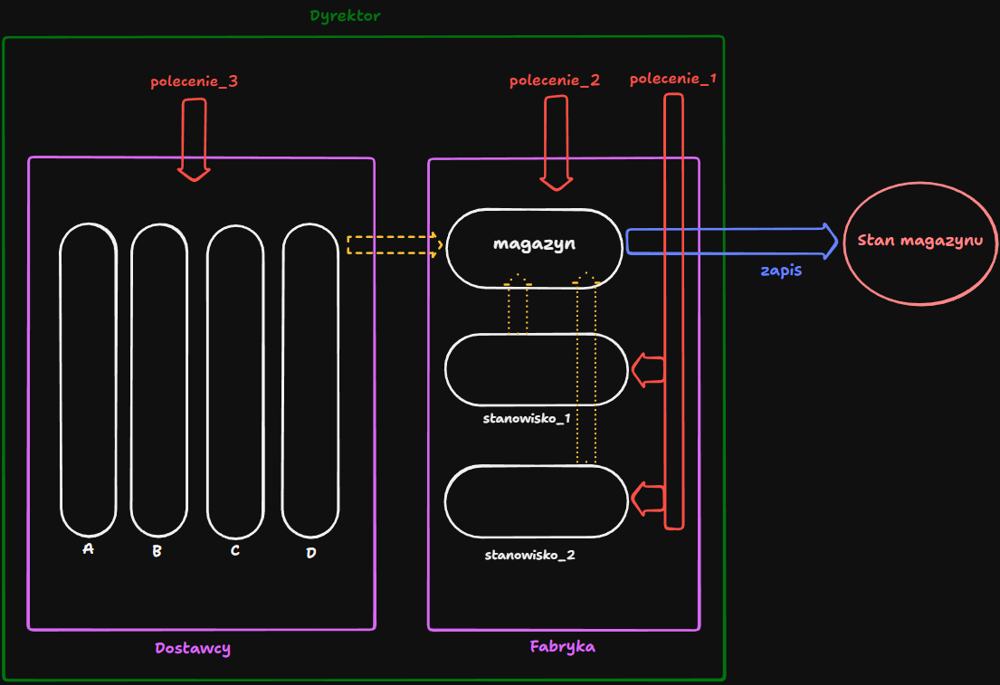

# SO - Fabryka Czekolady

Zadanie polega na zaprojektowaniu fabryki czekolady, w której produkowane są dwa typy czekolady. Pierwszy typ składa się ze składników A, B oraz C, drugi natomiast ze składników A, B i D. Składniki przechowywane są w magazynie o pojemności N jednostek. Każdy ze składników zajmuje określoną ilość miejsca w magazynie:

- A zajmuje 1 jednostkę
- B zajmuje 1 jednostkę
- C zajmuje 2 jednostki
- D zajmuje 3 jednostki

Fabryka składa się z dwóch stanowiski, na których produkowana jest czekolada danego typu. Dodatkowo przez cały czas pracy fabryki dostarczane są składniki do magazynu pochodzące z niezależnych źródeł. Nad fabryką czuwa, dyrektor który może wydawać następujące polecenia:
- polecenie_1: fabryka kończy pracę
- polecenie_2: magazyn kończy pracę
- polecenie_3: dostawcy przerywają dostawy
- polecenie_4: fabryka i magazyn kończą pracę (*połączenie poleceń 1 oraz 2*)

